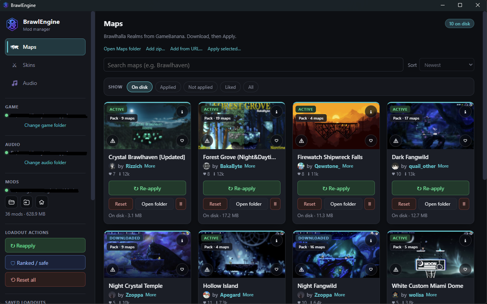
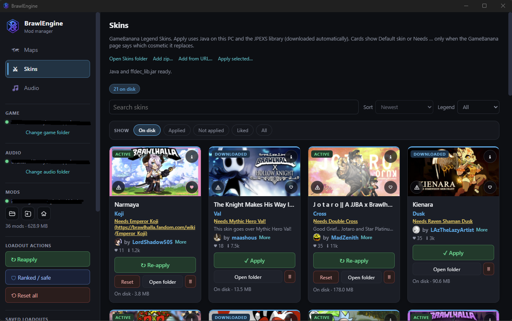
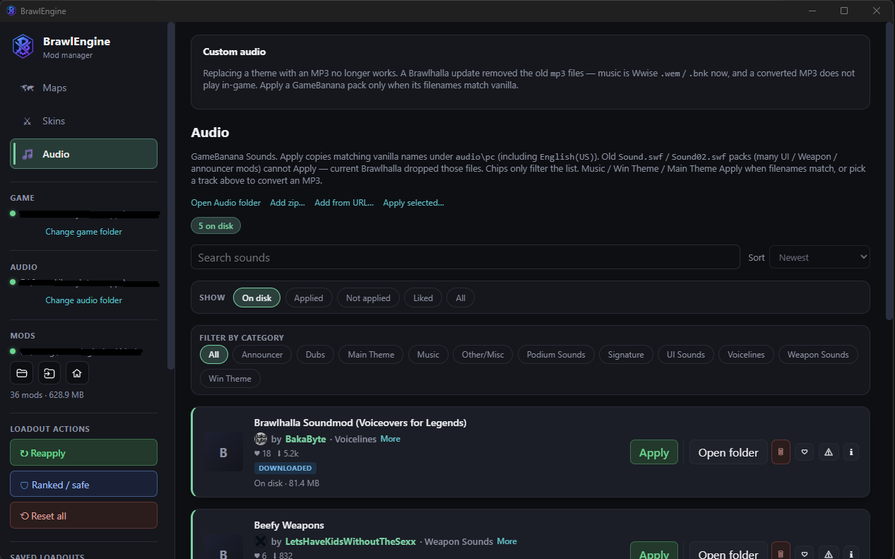

# BrawlEngine

Windows desktop app to browse [GameBanana](https://gamebanana.com/games/5704) Brawlhalla mods and apply them: **maps (realms)**, **skins**, and **audio**.

I built it because I wanted something that looks like a modern app, and because installing mods by hand was getting in the way — especially **skins** and **map art**. Download, Apply, keep a vanilla backup, restore when you need ranked. That is the whole point.

Unofficial. Not affiliated with Blue Mammoth Games.

## Screenshots







## What it does

- Lists GameBanana Realms, Legend Skins, and Sounds (catalog can be slow; that is their API).
- Downloads zip / rar / 7z into a **Mods** folder (`Maps`, `sounds`, `skins`).
- **Apply** writes into your Brawlhalla install after a one-time vanilla backup. If the game is open, Apply waits until it closes.
- **Reset** one pack or everything. **Ranked / safe** restores map art and skin SWFs and leaves audio.
- Add a zip from disk or a GameBanana URL if you would rather skip the catalog.

It is **not** Brawlhalla Mod Loader. That tool installs `.bmod` packs from Mod Creator. This one is for GameBanana archives and applying them to the game files.

## Requirements

- Windows 10 / 11
- Steam Brawlhalla
- **Java 11+** on the machine for skins (JPEXS `ffdec_lib` is fetched automatically)

Maps and most audio packs do not need Java.

## Install

No installer. Publish is a zip: extract it anywhere and run `BrawlEngine.exe`.

Settings, library cards, and backups live under `%LocalAppData%\BrawlEngine`. Downloaded archives go in the Mods folder (default next to that, or a folder you pick).

Windows may say **Unknown publisher**. That is an unsigned exe, not a virus scan by itself. More info → Run anyway. If SmartScreen bothers you, download the zip from [GitHub Releases](https://github.com/OwenOps/BrawlEngine/releases) and check [VirusTotal](https://www.virustotal.com) yourself.

## Ranked / Easy Anti-Cheat

- **Map art / backgrounds** — usually fine with EAC on.
- **Skins** — typically need `-noeac`. Ranked will not work with those files still in place.
- Use **Ranked / safe** before you queue, or **Reset all** if you want vanilla everything.

Cosmetic mods are a community thing. Tournaments have their own rules. This app does not bypass anti-cheat.

## Audio

**Custom audio** (replace a theme with your own MP3) is **hidden for now**. Brawlhalla dropped the old `mp3` files; converting to `.wem` did not change what the game plays, so that UI is off until there is a real fix.

Old **Sound.swf** UI / weapon packs cannot Apply — those files are gone from the game. A GameBanana pack is only copied in when its filenames already match vanilla `.wem` / `.bnk`.

## Build from source

```powershell
cd ui
npx ng build
cd ..\host
dotnet publish -c Release -r win-x64 --self-contained true -p:DebugType=None -o ..\dist\BrawlEngine
```

Do not ship `bin\Release` — that build needs the .NET 10 runtime on the PC.

### GitHub Release (zip)

From the repo root, after the publish above:

```powershell
if (Test-Path dist\BrawlEngine-0.6.0-win-x64.zip) { Remove-Item dist\BrawlEngine-0.6.0-win-x64.zip }
Compress-Archive -Path dist\BrawlEngine -DestinationPath dist\BrawlEngine-0.6.0-win-x64.zip
git push origin main
gh release create v0.6.0 dist\BrawlEngine-0.6.0-win-x64.zip --title "BrawlEngine 0.6.0 (beta)" --notes "First public beta. Extract the zip and run BrawlEngine.exe. Windows may warn about an unknown publisher."
```

A Release `dotnet publish` also drops a `BrawlEngine.lnk` on **your** desktop (post-build). You can delete that shortcut; it is not inside the zip.

Bump `<Version>` in `host/BrawlEngine.Host.csproj` before the next tag (`v0.6.1`, …) so the in-app update check can see it.

## Credits

BrawlEngine is [MIT](LICENSE). Third-party tools keep their own licenses: skin apply uses [JPEXS `ffdec_lib`](https://github.com/jindrapetrik/jpexs-decompiler) (LGPLv3); `wav2wem.exe` is GPLv2 from [pas2k/wav2wem](https://github.com/pas2k/wav2wem), run as a separate process (see `host/tools/NOTICE.txt`). Mods come from [GameBanana](https://gamebanana.com/games/5704).
